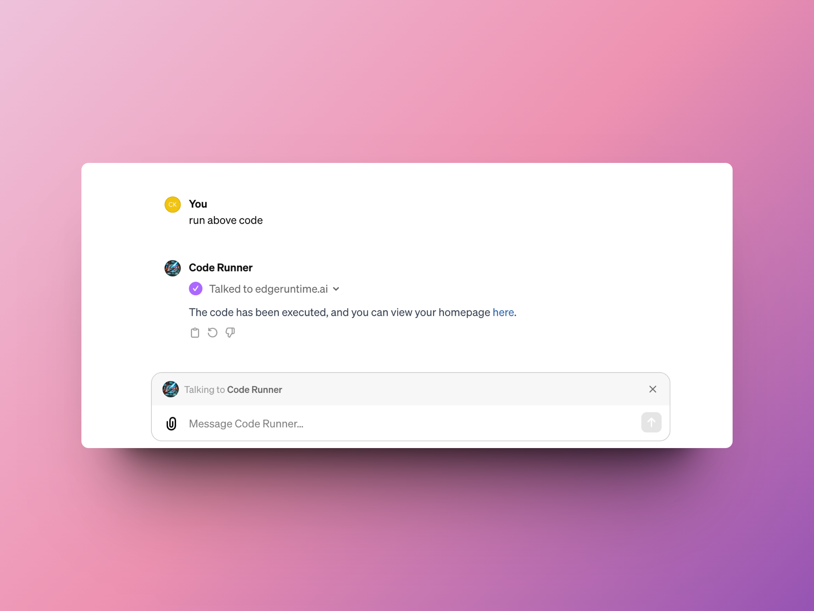

# Edge Runtime

A code playground with build-in Tailwind.CSS for AI

## Language support
* HTML
* JS
* CSS


## Play with ChatGPT

Now ChatGPT support tag any GPTs in your conservation, we can ask the [gpt](https://chat.openai.com/g/g-NFQikIaKU-code-runner) to run HTML/JS/CSS code

```
you: How to create graident background with Tailwind 

ChatGPT: Sure, here is the code ...

you: @Code Runner run above code
```




### Examples
* [Ask chat gpt to create home-page](https://www.edgeruntime.ai/html/AY9YDAtysKdC)